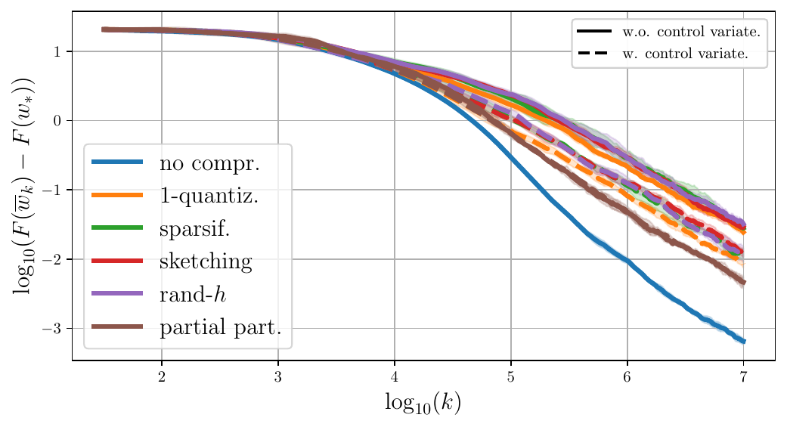

# Convergence rates for distributed, compressed and averaged least-squares regression: application to Federated Learning

We present here the code of the experimental parts of the following paper:
```
C. Philippenko and A. Dieuleveut, Convergence rates for distributed, compressed and averaged 
least-squares regression: application to Federated Learning, 2023.
```

In this paper, we investigate the impact of compression on stochastic gradient algorithms for machine learning, a 
technique widely used in distributed and federated learning.
We underline differences in terms of convergence rates between several unbiased compression operators, that all satisfy 
the same condition on their variance, thus going beyond the classical worst-case analysis.
To do so, we focus on the case of least-squares regression (LSR) and analyze a general stochastic approximation 
algorithm for minimizing quadratic functions relying on a random field. 
We consider weak assumptions on the random field, tailored to the analysis (specifically, expected Hölder regularity), 
and on the noise covariance, enabling the analysis of various randomizing mechanisms, including compression. 
We then extend our results to the case of federated learning.

From our analysis, several take-aways can be identified.
1. Quantization-based compression schemes do not have *Lipschitz in squared expectation* regularity but satisfy a 
Hölder condition. Because of that, their convergence is degraded, yet they asymptotically achieve a rate comparable to 
projection-based compressors, in which the limit covariance is similar.
2. Rand-h and partial participation with probability $h/d$ satisfy the same variance condition. Yet the convergence 
of compressed least mean squares algorithms for partial participation is more robust to ill-conditioned problems.
3. The asymptotic convergence rate is expected to be at least as good for quantization than for sparsification or 
randomized coordinate selection, *if* the features are standardized. On the contrary, if the features are independent
and the feature vector is normalized, then quantization is worse than  sparsification or randomized coordinate 
selection.

## Figures

### Impact of compression on additive noise covariance in 2 dimensions

We illustrate how compression affects the additive noise covariance, in a simple 
2-dimensional case,  for both a non-diagonal matrix $M$ and a diagonal one. 

1. $H$ not diagonal. Scatter plot of $(x_k)\_{i=1}^K$ / $(\mathcal{C}(x_k))\_{i=1}^K$
with its ellipse $\mathcal{E}\_{\mathrm{Cov} {x_k}}$ / $\mathcal{E}\_{\mathrm{Cov} {\mathcal{C} (x_k)}}$.


2. $H$ diagonal. Scatter plot of $(x_k)\_{i=1}^K$ / $(\mathcal{C}(x_k))\_{i=1}^K$
with its ellipse $\mathcal{E}\_{\mathrm{Cov} {x_k}}$ / $\mathcal{E}\_{\mathrm{Cov} {\mathcal{C} (x_k)}}$.


  

### Impact of $\mathrm{Tr}(\mathfrak{C}(\mathcal{C}, p_M) M^{-1} )$ using real dataset

We plot $\mathrm{Tr}(\mathfrak{C}(\mathcal{C}, p_M) M^{-1} )$ w.r.t.~the worst-case-variance-level 
$\omega of the compression in three scenarios: **(top-row)** -- with data standardization,
thus $\mathrm{Diag}(M)$ is constant equal to $1$; **(middle-row)** -- with a PCA, thus with a
diagonal covariance $M$ ; and **(bottom-row)** -- without any data transformation.
As a pre-processing, we have resized images of the cifar-10 dataset to a 
$16 \times 16$ dimension. 

<p float="left">
  
  
</p>

### Averaged compressed SGD on one client

1. High eigenvalues decay. **Left**: diagoonal covariance. **Right**: non-diagonal covariance.
  
<p float="left">
  
  
</p>

2. **Left**: high eigenvalues decay, non-diagoonal covariance, horizon-dependent step-size.
**Right**: slow eigenvalues decay, non-diagonal covariance.
  
<p float="left">
  
  
</p>

3. Real dataset for $\omega = 1$. **Left**: quantum, **right**: cifar10.

<p float="left">
  
  
</p>

### Averaged compressed SGD in Federated learning setting

#### Covariate-shift

1. **Left**: no-shift i.e. $\forall i,j \in [N], H_i = H_j$. **Right**: $\forall i,j \in [N], H_i \neq H_j$.
<p float="left">
  
  
</p>

2. Real dataset for $\omega = 1$ with a TSNE-based split. **Left**: quantum, **right**: cifar10. 
<p float="left">
  
  
</p>

#### Concept-shift wih slow eigenvalues decay using a memory mechanism

**Left**: batch stochastic gradient. **Right**: true gradient $g_k^i = \nabla F_i$.

<p float="left">
  
  
</p>

## Running experiments

Run the following commands to generate the illustrative figures in the article.

```python3 -m src.plotter_script.PlotTrace```

```python3 -m src.plotter_script.PlotEigenvalues```

```python3 -m src.plotter_script.PlotEllipse```

```python3 -m src.plotter_script.PlotCompressorRealDataset```

```python3 -m src.RealDatasetCov```

### SGD with a single client.

```python3 -m src.main --nb_clients 1 --dataset_size 10000000 --use_ortho_matrix False```

```python3 -m src.main --nb_clients 1 --dataset_size 2000000 --power_cov 4 --use_ortho_matrix True```

```python3 -m src.main --nb_clients 1 --dataset_size 2000000 --power_cov 4 --use_ortho_matrix True```

```python3 -m src.plotter_script.PlotHorizonSGD --nb_clients 1 --dataset_size 10000000 --power_cov 4 --use_ortho_matrix True```

```python3 -m src.main_real_datasets --dataset_name cifar10```

```python3 -m src.main_real_datasets --dataset_name cifar10```

### Federated learning.

```python3 -m src.main --nb_clients 10 --dataset_size 10000000 --use_ortho_matrix True --heterogeneity="homog"```

```python3 -m src.main --nb_clients 10 --dataset_size 10000000 --use_ortho_matrix True --heterogeneity="sigma"```

```python3 -m src.main_real_datasets --dataset_name quantum --use_memory False --heterogeneity tsne --nb_clients 10 --gamma_horizon False```

```python3 -m src.main_real_datasets --dataset_name cifar10 --use_memory False --heterogeneity tsne --nb_clients 10 --gamma_horizon False```

```python3 -m src.run_wstar_experiments --nb_clients 10 --use_ortho_matrix True --stochastic "True"```

```python3 -m src.run_wstar_experiments --nb_clients 10 --use_ortho_matrix True --stochastic "False"```

## Requirements

Using pip:
```pip install -c conda-forge -r requirements.txt python=3.7```. 

Or to create a conda environment: ```conda create -c conda-forge --name covariances_gpu_env --file requirements.txt python=3.7```.

## Maintainers

[@ConstantinPhilippenko](https://github.com/philipco)

## License

[MIT](LICENSE) © Constantin Philippenko

# References
If you use this code, please cite the following papers

```
@article{philippenko2023convergence,
  title={Convergence rates for distributed, compressed and averaged least-squares regression: 
application to Federated Learning},
  author={Philippenko, Constantin and Dieuleveut, Aymeric},
  journal={arXiv e-prints},
  year={2023}
}
```